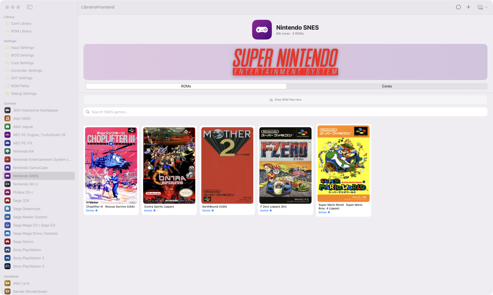

# LibretroFrontend for Mac

A native macOS front end for [libretro](https://www.libretro.com/) emulator cores. One app, your whole game library: it manages the cores, organises your ROMs into a browsable library with box art, and runs the games.

**Apple Silicon (arm64) · macOS 14 or newer**

<p align="center">
  
</p>

---

## Download

Grab the `.dmg` from the [latest release](https://github.com/ku16610/libretro-frontend-mac/releases/latest) and drag `LibretroFrontend.app` into your **Applications** folder.

You need your own games — ROMs are not included, and none can be downloaded from within the app.

---

## Running it the first time: allowing the app through Gatekeeper

This app is signed locally rather than with a paid Apple developer certificate, so macOS's Gatekeeper will stop it the first time you launch it. **This is expected, and it is safe to allow** — the warning is about the missing signature, not about a problem with the app.

Open the app once, and macOS will show:

> LibretroFrontend cannot be opened because the developer cannot be verified.

Then allow it:

1. Open **System Settings**.
2. Go to **Privacy & Security**.
3. Scroll down to the **Security** section — you'll see a note saying macOS blocked the app, with an **Open Anyway** button. Click it.
4. Confirm with **Open**. The app launches normally.

The "Open Anyway" button only appears *after* you've tried to open the app once and it was blocked, so do that first.

### If there's no "Open Anyway" button

macOS sometimes reports the app as "damaged" instead, particularly if the disk image was copied rather than mounted and dragged. Clear the quarantine flag in Terminal:

```sh
xattr -dr com.apple.quarantine /Applications/LibretroFrontend.app
```

Then launch it normally. You can also **right-click (or Control-click) the app in Finder and choose Open** — that is the same override, through a different dialog.

You only have to do this once. After the first successful launch macOS remembers the decision.

---

## Setting up

**1. Cores.** Open the **Core Library** in the sidebar to see what's installed, and install what you need. Cores are downloaded individually, so you only get the emulators for the systems you actually play.

**2. Games.** Drag ROMs onto the window, or drop them on the relevant system in the sidebar — the app sorts them in and fetches cover art. `.zip`, `.7z` and `.rar` archives are expanded for you.

**3. BIOS files.** Some systems need firmware or BIOS ROMs that the app can't supply. **BIOS Settings** lists exactly which files each installed core is waiting for, marks the ones you already have, and tells you precisely what's missing. Most of those systems simply won't boot until the file is in place.

**4. Controllers.** **Controller Settings** maps gamepads and keyboards to each system's buttons. Most pads are recognised automatically.

---

## What else it does

- **Per-game settings** — machine model, RAM, CPU and storage options for systems that expose them, saved per game rather than globally.
- **Multi-disk sets** — numbered disks dropped together are grouped into a single entry. For Amiga sets you can see which disk goes in which drive and fix the order if a dump has it wrong.
- **Save states, screenshots and rewind** — multiple state slots, a screenshot on close, and automatic save/restore when you quit mid-game.
- **TAS recording** — record a session's input from the right-click menu and replay it back later from the same point the game boots.
- **Shader filters** — scanline and CRT-style looks, per game.
- **Scraping** — DAT-based title and artwork lookup for arcade sets.
- **Shader and core options** exposed per game, so a setting that should only apply to one title doesn't apply to all of them.

---

## Notes

- Cores run with the usual caveats of any emulator: hardware not emulated (rumble, some copy protection) may not work, and each core has its own quirks.
- Performance varies by core and by the Mac. Cores that lean on recompiled code (Dolphin, PS3, Switch) need the most.
- The app is unsigned and unnotarised, hence the Gatekeeper step above.
- This repository holds **downloads only**. Issue reports and feature requests are welcome here; the app is not open source.

## Licence

The front end is provided as-is, free of charge. Emulator cores and games are separate downloads with their own licences and are not distributed here.
